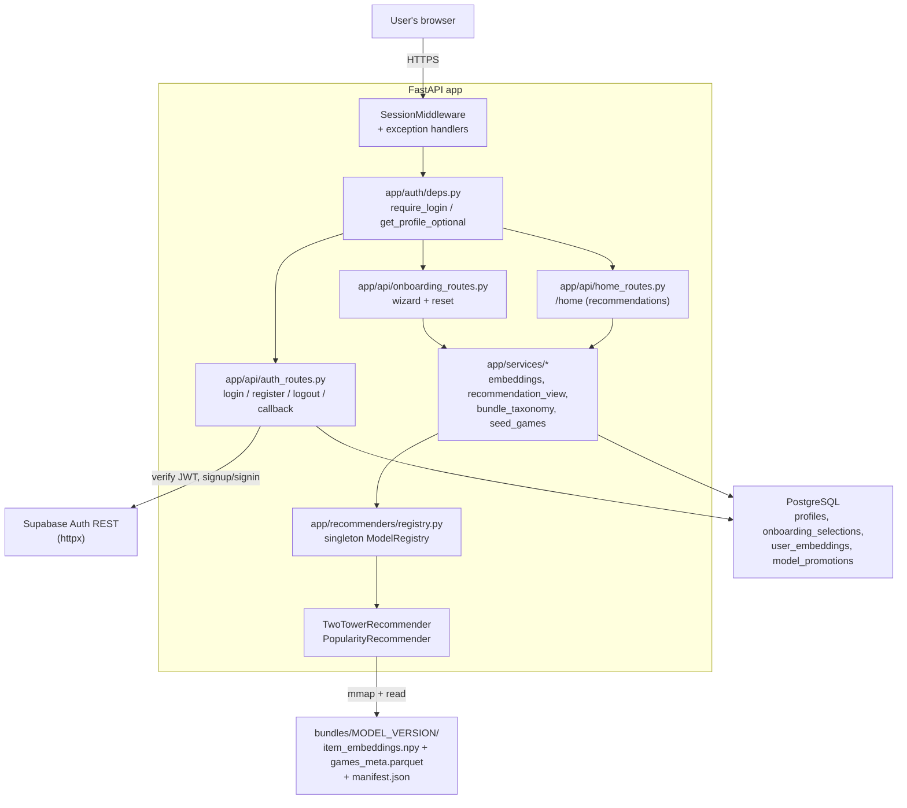
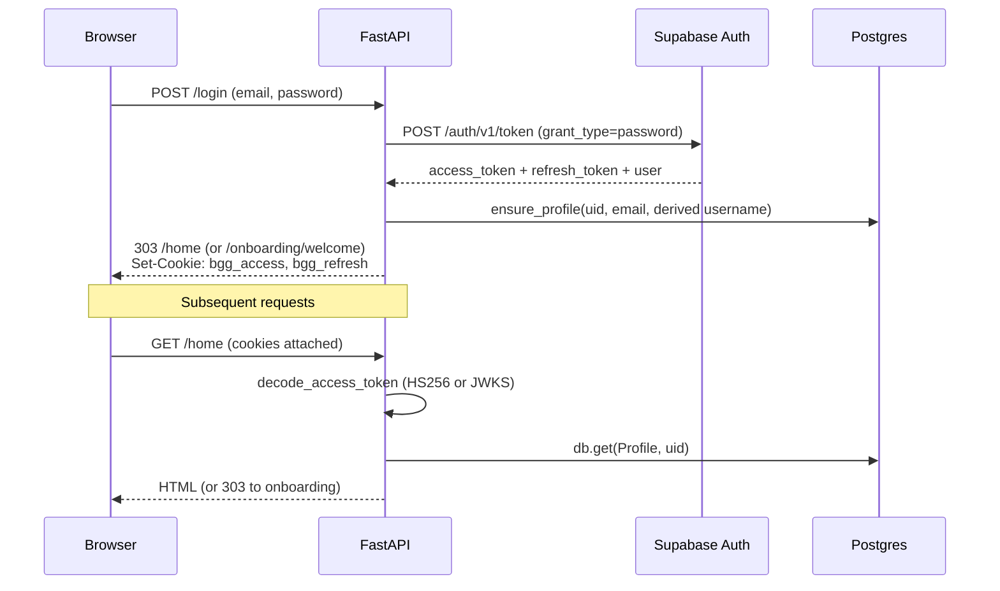
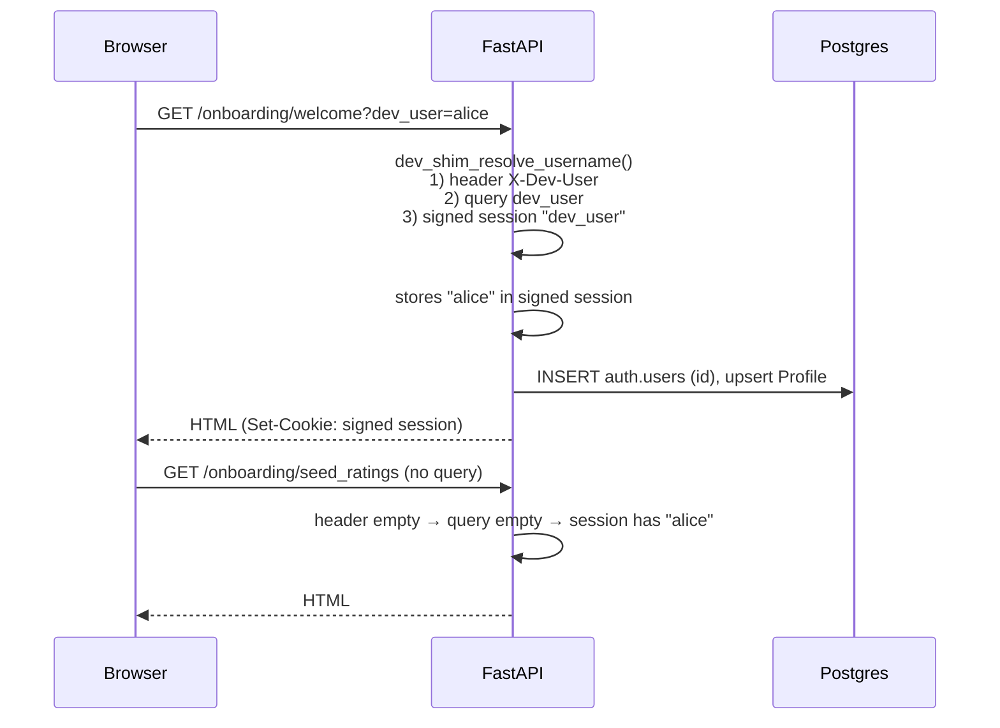
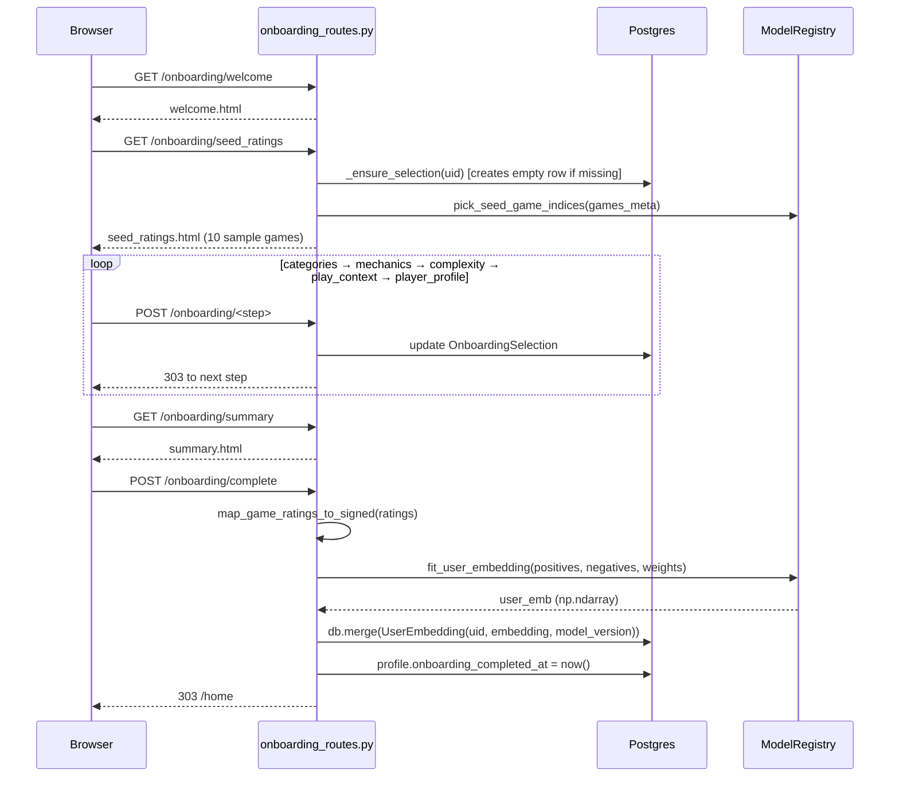
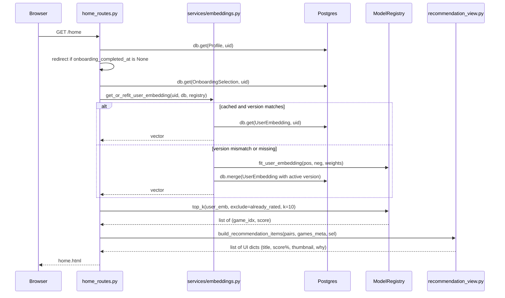
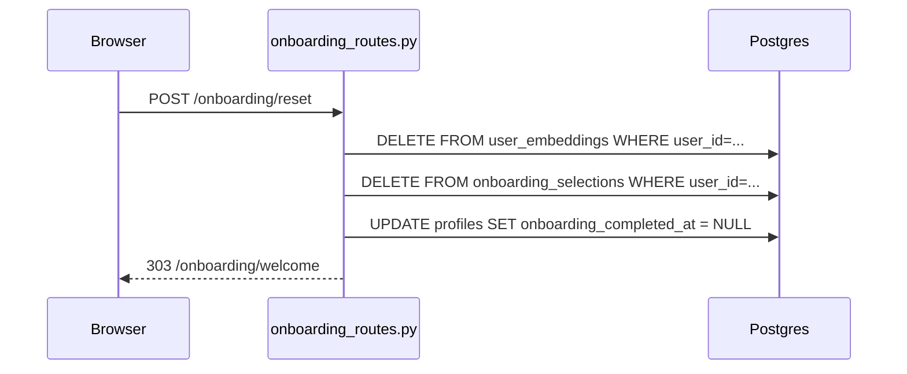
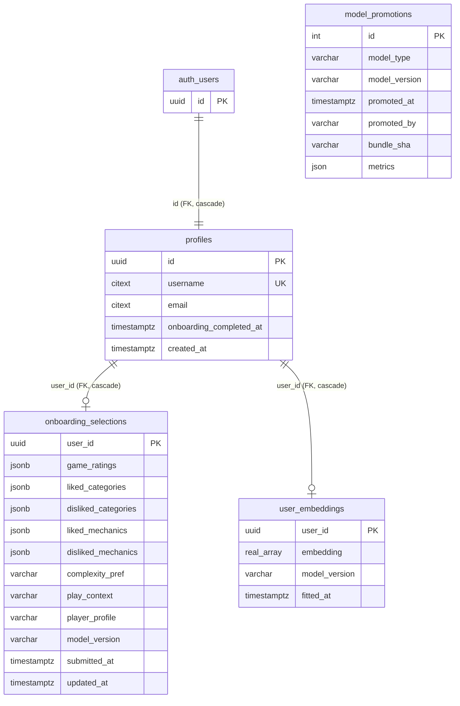

# Architecture — read this first

A guided tour of the BGG Recommendation System for new contributors. After reading this you should be able to open any Python file in [app/](../app/) and understand what it does, who calls it, and how it fits into the request flow.

For setup, see [local-development.md](local-development.md). For production deploy, see [production.md](production.md).

---

## Table of contents

1. [What this app is](#1-what-this-app-is)
2. [Tech stack at a glance](#2-tech-stack-at-a-glance)
3. [Bird's-eye view](#3-birds-eye-view)
4. [Module map](#4-module-map)
5. [Domain glossary](#5-domain-glossary)
6. [Key request flows](#6-key-request-flows)
7. [Recommendation subsystem](#7-recommendation-subsystem)
8. [Database schema](#8-database-schema)
9. [Templates & static assets](#9-templates--static-assets)
10. [Testing strategy](#10-testing-strategy)
11. [Onboarding for new contributors](#11-onboarding-for-new-contributors)

---

## 1. What this app is

A server-rendered web app that recommends board games to BoardGameGeek-style users.

A user signs up (Supabase Auth), runs through a short onboarding wizard where they rate 10 sample games and optionally state preferences (categories, mechanics, complexity, group context), and is then shown 10 personalized picks on their home page. Picks come from a **two-tower retrieval model** whose item embeddings ship as a versioned bundle on disk; per-user embeddings are computed on the fly from the user's onboarding ratings and cached in Postgres.

**Phase 1 scope.** The app is intentionally simple:

- One-shot onboarding produces one user embedding. There is no continuous learning, implicit feedback collection, or A/B routing yet.
- Item embeddings are precomputed and shipped in the bundle. The training code lives in [notebooks/bgg_phase1_trevor_v2_2_fixed.ipynb](../notebooks/bgg_phase1_trevor_v2_2_fixed.ipynb) (Google Colab, GPU); the runtime only loads the exported artifacts. The `manifest.json` says `"trained_by": "export"`.
- Recommendations are deterministic for a given user given a given `MODEL_VERSION`. Reranking, diversity penalties, and contextual blending are out of scope.

---

## 2. Tech stack at a glance

| Layer | Choice | Notes |
|---|---|---|
| Language | Python 3.11+ | |
| HTTP framework | FastAPI | Routes live in [app/api/](../app/api/) |
| Templating | Jinja2 SSR | Templates in [app/templates/](../app/templates/) |
| ORM / migrations | SQLAlchemy 2.x + Alembic | Models in [app/db/models/](../app/db/models/) |
| Database | PostgreSQL (Supabase pooler in prod, local Postgres via Docker in dev) | |
| Auth | Supabase Auth (JWT in HTTP-only cookies); `dev_shim` mode for local dev | [app/auth/](../app/auth/) |
| Model serving | NumPy + Pandas + PyArrow | No Torch at request time |
| Config | Pydantic Settings loaded from `.env.local` | [app/config.py](../app/config.py) |
| Static assets | FastAPI StaticFiles | `static_url()` helper in [app/main.py](../app/main.py) appends an mtime query string for cache busting |
| Deployment | Docker image to DigitalOcean droplet, Caddy in front | [docs/production.md](production.md) |

---

## 3. Bird's-eye view



**Reading the diagram.** A browser request lands on FastAPI middleware, gets resolved into a `Profile` by [app/auth/deps.py](../app/auth/deps.py) (`require_login` is the typed dependency every protected route uses), then runs through one of the three route modules. Routes delegate computation to `app/services/*` modules, which read/write Postgres and call into the singleton `ModelRegistry` for embedding math. The active recommender holds memory-mapped item embeddings loaded from the on-disk bundle at process startup.

---

## 4. Module map

### [app/api/](../app/api/) — HTTP routes

Three route modules, all registered in [app/main.py](../app/main.py):

- **[auth_routes.py](../app/api/auth_routes.py)** — `GET/POST /login`, `GET/POST /register`, `POST /logout`, `GET /auth/callback`, `POST /auth/set-session` (called by the email-confirm JS handoff page), `GET /login/mfa` placeholder.
- **[home_routes.py](../app/api/home_routes.py)** — `GET /` (entry redirect) and `GET /home` (the recommendations page).
- **[onboarding_routes.py](../app/api/onboarding_routes.py)** — the 7-step wizard (`/onboarding/welcome` through `/onboarding/complete`) plus `POST /onboarding/reset`.

Convention: every protected route declares `user: DependsLogin` (typed alias of `Annotated[Profile, Depends(require_login)]`) and `db: Session = Depends(get_db)`. SSR redirects return `RedirectResponse(target, status_code=303)`; the global exception handler in `main.py` converts `HTTPException(303, headers={"Location": ...})` (raised from auth deps) into the same redirect.

### [app/auth/](../app/auth/) — Authentication

- **[deps.py](../app/auth/deps.py)** — `require_login` (the dependency every protected route uses), `get_profile_optional`, and the `ensure_profile` upsert that keeps a local `profiles` row in sync with Supabase user metadata.
- **[supabase_jwt.py](../app/auth/supabase_jwt.py)** — verifies access-token signatures. Supports legacy HS256 (shared secret) and modern ES256/ES384/ES512/RS256 (JWKS fetched once from `<SUPABASE_URL>/auth/v1/.well-known/jwks.json`).
- **[supabase_client.py](../app/auth/supabase_client.py)** — thin sync `httpx` wrappers around the Supabase Auth REST endpoints (signup, sign in, refresh, logout, MFA).
- **[cookies.py](../app/auth/cookies.py)** — set/clear the two HTTP-only cookies `bgg_access` and `bgg_refresh`.
- **[dev_shim.py](../app/auth/dev_shim.py)** — local-only escape hatch. With `ENVIRONMENT=local` + `AUTH_MODE=dev_shim`, a header (`X-Dev-User: alice`), query parameter (`?dev_user=alice`), or signed session entry resolves to a deterministic `Profile` without any Supabase round trip.

### [app/db/](../app/db/) — Database

- **[session.py](../app/db/session.py)** — the engine + `SessionLocal` + `get_db()` generator used as a FastAPI dependency.
- **[base.py](../app/db/base.py)** — `Base = DeclarativeBase` with PostgreSQL-friendly constraint naming.
- **[supabase_auth_ref.py](../app/db/supabase_auth_ref.py)** — declares a *reference-only* `auth.users` table so `profiles.id` can FK to it. Alembic never creates this; Supabase owns it.
- **[models/](../app/db/models/)** — the four ORM models:
  - [`Profile`](../app/db/models/profile.py) — application user (1:1 with `auth.users.id`).
  - [`OnboardingSelection`](../app/db/models/onboarding.py) — JSONB blob of the user's wizard answers.
  - [`UserEmbedding`](../app/db/models/user_embedding.py) — cached user vector + the `model_version` it was fit against.
  - [`ModelPromotion`](../app/db/models/model_promotion.py) — audit table for bundle promotions (not wired into serving yet).

### [app/recommenders/](../app/recommenders/) — Model serving

- **[base.py](../app/recommenders/base.py)** — `BaseRecommender` ABC. Every implementation must implement `load(model_dir)`, `fit_user_embedding(positives, negatives, weights)`, `top_k(user_emb, exclude, k)`, and `healthcheck()`.
- **[registry.py](../app/recommenders/registry.py)** — the `ModelRegistry` singleton + the `@register("name")` decorator. Reads `manifest.json` from the active bundle, looks up the registered class by `model_type`, and loads it. Falls back to `popularity-v1-fixture` on any failure.
- **[two_tower.py](../app/recommenders/two_tower.py)** — production recommender. Memory-maps `item_embeddings.npy`, fits the user vector as an L2-normalized weighted sum, scores with a dot product.
- **[popularity.py](../app/recommenders/popularity.py)** — Phase 1 fallback. Ranks by `popularity_score` and ignores the user vector for ranking.

The `@register(...)` decorators run at import time when [app/main.py](../app/main.py) imports `popularity` and `two_tower` for their side effects.

### [app/services/](../app/services/) — Request-time logic

Anything that's neither HTTP plumbing nor pure ORM/storage:

- **[embeddings.py](../app/services/embeddings.py)** — `map_game_ratings_to_signed` (Love/Like/Dislike/Hate → signed weights) and `get_or_refit_user_embedding` (cache-or-recompute the user vector).
- **[recommendation_view.py](../app/services/recommendation_view.py)** — turns `(game_idx, raw_score)` pairs into UI-ready dicts: normalized match percentages, thumbnails, prose `why` strings.
- **[bundle_taxonomy.py](../app/services/bundle_taxonomy.py)** — reads category/mechanic label lists from the active bundle (`categories.json` if present, else inferred from parquet). Also exports `plain_description` which strips HTML tags AND decodes HTML entities from BGG descriptions.
- **[seed_games.py](../app/services/seed_games.py)** — deterministic selection of the 10 sample games shown to every user during onboarding, spread across BGG `averageweight` buckets so the model gets a complexity signal.
- **[play_context_field.py](../app/services/play_context_field.py)** — split/merge for the single 64-char `play_context` DB column (preset + optional detail).

### [app/templates/](../app/templates/) — Jinja SSR

- **[base.html](../app/templates/base.html)** — outer layout (header nav, CSS link via `static_url()`).
- **[home.html](../app/templates/home.html)** — recommendations page (uses `page-header` flex row for heading + Reset button).
- **[auth/](../app/templates/auth/)** — `login.html`, `register.html`, `callback.html`, `mfa.html`.
- **[onboarding/](../app/templates/onboarding/)** — wizard step pages (welcome, seed_ratings, categories, mechanics, complexity, play_context, player_profile, summary).

### [app/static/](../app/static/) — Static assets

A single `css/app.css` with dark-mode-friendly button styles (`button`, `button.secondary`, `button.danger`), the `inline-form` and `page-header` layout helpers, and the rec/onboarding card styles. URLs are versioned via `static_url('css/app.css')` so a stylesheet edit auto-busts the browser cache.

### [app/config.py](../app/config.py)

A single `Settings` (Pydantic) instance read from `.env.local`. The most operationally important values are `DATABASE_URL`, `MODEL_BUNDLE_PATH`, `MODEL_VERSION`, `AUTH_MODE`, and the Supabase URL/keys.

### [app/onboarding_constants.py](../app/onboarding_constants.py)

UI-facing constants used by both the templates and the routes: `SEED_GAME_COUNT`, the `PLAY_CONTEXT_MAIN_OPTIONS` chips, length caps.

---

## 5. Domain glossary

| Term | Meaning |
|---|---|
| **BGG** | [BoardGameGeek](https://boardgamegeek.com) — the source of the game catalog. Each game has a stable `bgg_id`. |
| **Onboarding wizard** | The 7-step flow at `/onboarding/*` that captures user preferences and produces the first user embedding. |
| **Seed games** | The 10 sample games shown to every user during onboarding. Same for every user given a `MODEL_VERSION`, picked deterministically by [seed_games.py](../app/services/seed_games.py). |
| **Game index (`game_idx`)** | An *internal* row position in the bundle's `games_meta.parquet`. Used as the index into `item_embeddings.npy`. Not user-facing. |
| **Bundle** | The on-disk directory `bundles/<MODEL_VERSION>/` containing `manifest.json`, `item_embeddings.npy`, `games_meta.parquet`, and optional `categories.json`. The whole thing is shipped as a unit. |
| **`MODEL_VERSION`** | The bundle name pinned by env var. Production CI defaults to `bgg-two-tower-v1`. Changing it changes which bundle is loaded **and** invalidates cached user embeddings. |
| **Item embedding** | A dense float vector per game, precomputed offline and shipped in `item_embeddings.npy`. Read-only at runtime, memory-mapped for low startup cost. |
| **User embedding** | A dense float vector per user, computed by `fit_user_embedding` from the user's seed-game ratings and stored in `user_embeddings.embedding`. |
| **Two-tower retrieval** | The recommendation strategy: score every item by `item_emb @ user_emb`, return top-k. The "two towers" are the item encoder (offline, produced the `.npy`) and the user encoder (in this repo, a heuristic weighted sum — see [§7](#7-recommendation-subsystem)). |
| **Match percent / match 10** | Per-request normalization: the top score in each response is 100% / 10.0, the bottom is 0% / 1.0, others linearly in between. Not a global truth. |
| **Refit** | Recomputing a user's embedding because the active `MODEL_VERSION` no longer matches the `model_version` stored on the user's `UserEmbedding` row. Triggered lazily on the next `/home` visit. |
| **Reset** | The user-initiated equivalent of "start over": delete the user's `UserEmbedding` and `OnboardingSelection` rows and clear `onboarding_completed_at`. Implemented at `POST /onboarding/reset`. |
| **Model promotion** | A row in `model_promotions` recording when a new bundle became active. The table exists but is not wired into serving yet — current selection is purely by env var. |

---

## 6. Key request flows

### 6.1 Authentication — Supabase mode



Key files: [app/api/auth_routes.py](../app/api/auth_routes.py) (`login_post`, `register_post`), [app/auth/deps.py](../app/auth/deps.py) (`require_login`, `get_profile_optional`, `ensure_profile`), [app/auth/supabase_jwt.py](../app/auth/supabase_jwt.py) (`decode_access_token`).

If the access token is expired/invalid, `decode_access_optional` automatically tries `try_refresh_tokens` once before giving up.

### 6.2 Authentication — `dev_shim` mode

Local-only escape hatch. `require_login` calls `get_profile_for_dev_header` which resolves the username via header → query param → session, then upserts a deterministic `Profile` keyed by `uuid.uuid5(NAMESPACE_DNS, username)`. No Supabase calls, no JWT decoding.



Hard-gated: [`assert_dev_shim_safe()`](../app/auth/dev_shim.py) raises `RuntimeError` outside `ENVIRONMENT=local + AUTH_MODE=dev_shim`.

### 6.3 Onboarding wizard



Validation at `POST /onboarding/complete`: the user must have at least one non-`never_played` rating, and `map_game_ratings_to_signed` must yield at least one positive or negative. Otherwise the user is bounced back to `/onboarding/seed_ratings` with an error query parameter.

### 6.4 Home recommendations



Key file: [app/services/embeddings.py](../app/services/embeddings.py). The `get_or_refit_user_embedding` function is the heart of the lazy-refit story.

### 6.5 Reset



After reset, the very next `GET /home` falls into one of the existing "no completion" / "no selection" / "ValueError onboarding_required" branches and 303s to `/onboarding/welcome` — no special-casing needed.

---

## 7. Recommendation subsystem

### 7.1 Bundle layout

A bundle is a directory under `MODEL_BUNDLE_PATH` (defaults to `bundles/` in the repo) named after the `MODEL_VERSION`. For the production bundle `bgg-two-tower-v1/`:

```
bundles/bgg-two-tower-v1/
├── manifest.json          # model_type, version, schema_version, trained_by
├── item_embeddings.npy    # shape (n_items, dim), float32, mmap'd at runtime
├── games_meta.parquet     # rows aligned to item_embeddings; columns: game_idx, bgg_id, title, description, thumbnail, boardgamecategory, boardgamemechanic, averageweight, usersrated, ...
├── categories.json        # optional curated category list for onboarding chips
└── (two_tower.pt, *.pkl)  # bundle metadata; not loaded by runtime today
```

The `.npy` and `.parquet` files are tracked with Git LFS — a fresh clone needs `git lfs pull` before the app can start.

**Where the bundle came from.** The contents of `bundles/bgg-two-tower-v1/` were produced offline by [notebooks/bgg_phase1_trevor_v2_2_fixed.ipynb](../notebooks/bgg_phase1_trevor_v2_2_fixed.ipynb) (Google Colab, T4 GPU) against the [BoardGameGeek Reviews Kaggle dataset](https://www.kaggle.com/datasets/jvanelteren/boardgamegeek-reviews). The notebook benchmarks a Bayesian popularity baseline, a TF-IDF content-based model, and the two-tower neural network we actually ship. See [notebooks/README.md](../notebooks/README.md) for the export-to-bundle mapping and retraining steps.

### 7.2 Registry initialization

On app startup, FastAPI runs the `lifespan` context in [app/main.py](../app/main.py):

```python
async def lifespan(app: FastAPI):
    registry.load_active()   # reads manifest, instantiates the right recommender
    app.state.templates = templates
    yield
```

`registry.load_active()`:

1. Reads `manifest.json` from `bundles/<MODEL_VERSION>/`.
2. Looks up `manifest["model_type"]` in the `_RECOMMENDERS` dict populated by `@register(...)` decorators.
3. Calls `<Cls>.load(bundle_dir)` to construct the recommender.
4. On any failure, falls back to loading `popularity-v1-fixture`.

The result is held in `ModelRegistry._rec` and exposed read-only via `registry.recommender`. Every request shares the same instance.

### 7.3 Two-tower retrieval at request time

**Item side** (offline → bundled):
- `item_emb` is loaded with `np.load(..., mmap_mode="r")` so process startup pays only the kernel page-cache cost. Stored as `float32`.

**User side** (online):

```python
def fit_user_embedding(positives, negatives, weights):
    acc = sum(w * item_emb[gi] for gi, w in zip(positives + negatives, weights))
    return acc / np.linalg.norm(acc)   # L2-normalized
```

The user "tower" is a heuristic weighted average, not a trained neural forward pass. Weights come from [`map_game_ratings_to_signed`](../app/services/embeddings.py): Love=+1.0, Like=+0.5, Dislike=−0.5, Hate=−1.0, Never played=skipped.

**Scoring**:

```python
scores = item_emb @ user_emb   # (n_items,)
# mask already-rated indices to -inf, then argpartition for top-k
```

### 7.4 Why per-user embeddings are stored

Computing the user vector is cheap (one matrix-vector op), but reading from Postgres is even cheaper, and storing it lets us answer "what model produced this vector" via the `model_version` column. The cache invalidation rule is simple: if the row's `model_version` differs from `settings.MODEL_VERSION`, we refit on the next `/home` visit. See [`get_or_refit_user_embedding`](../app/services/embeddings.py).

### 7.5 Promoting a new bundle

Drop a new directory under `bundles/`, set `MODEL_VERSION=<new-name>` in the prod env, redeploy. The next user request triggers refit-on-version-mismatch for every active user automatically. The `model_promotions` table is meant to record this event but is not yet read by the registry.

---

## 8. Database schema

Four application tables, all keyed by `user_id` (or `id` on `profiles`) which FKs to `auth.users.id` owned by Supabase.



**Notes**:
- `profiles.id` references `auth.users.id` via a reference-only declaration in [app/db/supabase_auth_ref.py](../app/db/supabase_auth_ref.py). Alembic never creates the `auth.users` table — Supabase owns it. In local-only setups with no Supabase, [`dev_shim.py`](../app/auth/dev_shim.py) inserts placeholder `auth.users` rows so the FK is satisfied.
- All FKs to `profiles.id` use `ON DELETE CASCADE`. Deleting a profile cleans up onboarding + embedding rows.
- `user_embeddings.embedding` is a Postgres `REAL[]` (variable-length array of `float4`). The dimension is determined by the bundle.
- `onboarding_selections.game_ratings` is JSONB shaped like `[{"game_idx": 13, "label": "love"}, ...]`.

The canonical ERD with extra detail is in [BGG_Recommender_Phased_ERD_v8.docx](BGG_Recommender_Phased_ERD_v8.docx).

---

## 9. Templates & static assets

### Layout

[app/templates/base.html](../app/templates/base.html) is the outer chrome — header nav with username + "Recommendations" / "Onboarding" link + "Log out" button. All other templates ``.

### Button styles

Buttons are styled by class. The CSS lives in [app/static/css/app.css](../app/static/css/app.css):

- Default `<button>` — green accent, used for primary CTAs.
- `<button class="secondary">` — transparent, muted text. Best on dark header bars next to other nav (looks intentional when context is clear).
- `<button class="danger">` — soft red, used for destructive actions like Reset.
- `<form class="inline-form">` — `display: inline`, used so a single-button form doesn't break flex layouts.
- `<div class="page-header">` — flex row with `justify-content: space-between`, used to put a heading on the left and a page-level action button on the right (see `home.html`).

### Cache busting

[app/main.py](../app/main.py) registers `static_url(path)` as a Jinja global:

```python
templates.env.globals["static_url"] = static_url   # appends ?v=<mtime>
```

`base.html` uses it for the stylesheet: `<link rel="stylesheet" href="{{ static_url('css/app.css') }}" />`. Editing the CSS changes the file mtime, which changes the query string, which forces every browser to refetch. No more "I edited the CSS but the page still looks old" debugging.

---

## 10. Testing strategy

All tests live in [tests/](../tests/). The suite has two flavors:

### Unit tests with `MagicMock`

For pure logic that doesn't need an HTTP layer. Mock the `Session` / `ModelRegistry` and assert calls. Example: [tests/test_embeddings_refit.py](../tests/test_embeddings_refit.py) verifies the cache-hit / version-mismatch / no-onboarding branches of `get_or_refit_user_embedding` without touching Postgres.

### Integration tests with `TestClient` + `app.dependency_overrides`

For HTTP behavior — routing, redirects, cookies. Use FastAPI's dependency-override mechanism to swap real deps for fakes:

```python
from app.auth.deps import require_login
from app.db.session import get_db
from app.main import app

app.dependency_overrides[require_login] = lambda: fake_user
app.dependency_overrides[get_db] = lambda: fake_db
try:
    with TestClient(app) as client:
        r = client.post("/onboarding/reset", follow_redirects=False)
    assert r.status_code == 303
    assert r.headers["location"] == "/onboarding/welcome"
finally:
    app.dependency_overrides.pop(require_login, None)
    app.dependency_overrides.pop(get_db, None)
```

See [tests/test_onboarding_reset.py](../tests/test_onboarding_reset.py) and [tests/test_login_cookies.py](../tests/test_login_cookies.py) for the canonical patterns.

### What gets covered today

- Auth dep parsing ([test_dev_shim_identity.py](../tests/test_dev_shim_identity.py), [test_auth_decode_refresh.py](../tests/test_auth_decode_refresh.py))
- Profile upsert collisions ([test_profile_username_in_use.py](../tests/test_profile_username_in_use.py), [test_profile_username_normalize.py](../tests/test_profile_username_normalize.py))
- Login cookies ([test_login_cookies.py](../tests/test_login_cookies.py))
- Recommendation pipeline ([test_recommendation_view.py](../tests/test_recommendation_view.py), [test_embeddings_refit.py](../tests/test_embeddings_refit.py), [test_popularity_contract.py](../tests/test_popularity_contract.py), [test_mapping.py](../tests/test_mapping.py), [test_seed_games.py](../tests/test_seed_games.py))
- Reset flow ([test_onboarding_reset.py](../tests/test_onboarding_reset.py))
- Misc parsing ([test_play_context_field.py](../tests/test_play_context_field.py), [test_supabase_auth_message.py](../tests/test_supabase_auth_message.py))
- Health endpoint + root redirect ([test_healthz.py](../tests/test_healthz.py))

Run with `pytest -q`. There is no `conftest.py` — tests are self-contained.

---

## 11. Onboarding for new contributors

### Run the app locally

See [docs/local-development.md](local-development.md) for the full setup. Quickstart:

```powershell
docker compose up -d postgres
copy .env.example .env.local        # then edit secrets
pip install -e ".[dev]"
alembic upgrade head
uvicorn app.main:app --reload
```

For zero-Supabase local dev, set `AUTH_MODE=dev_shim` in `.env.local` and visit `http://127.0.0.1:8000/onboarding/welcome?dev_user=yourname` once.

### Where do I put X?

| I want to... | Put it in... |
|---|---|
| Add a new HTTP route | A new file in [app/api/](../app/api/), register the router in [app/main.py](../app/main.py). Use `DependsLogin` + `get_db`. |
| Add a new ORM table | A new module in [app/db/models/](../app/db/models/), import it in [app/db/models/__init__.py](../app/db/models/__init__.py), then `alembic revision --autogenerate -m "..."`. |
| Add per-request computation | A function in [app/services/](../app/services/). Routes should stay thin. |
| Add a recommender variant | A new module in [app/recommenders/](../app/recommenders/) with `@register("name")`, then import it from [app/recommenders/__init__.py](../app/recommenders/__init__.py) so the decorator runs. |
| Add a wizard step | A new GET/POST pair in [onboarding_routes.py](../app/api/onboarding_routes.py) + a template in [app/templates/onboarding/](../app/templates/onboarding/) + a new column on `OnboardingSelection` if you need to persist it. |
| Change something stored in `onboarding_selections.game_ratings` | Update both `map_game_ratings_to_signed` in [embeddings.py](../app/services/embeddings.py) and the radio inputs in `seed_ratings.html`. |

### Conventions worth knowing

- **Redirects**: routes return `RedirectResponse(target, status_code=303)`. Auth deps raise `HTTPException(303, headers={"Location": target})`; the handler in `main.py` converts it to a real redirect.
- **Cookies on redirects**: must be set on the *same* `Response` object that's returned (see [test_login_cookies.py](../tests/test_login_cookies.py) — this is a regression test for a real past bug).
- **Imports for side-effecting decorators**: `popularity` and `two_tower` are imported from [app/main.py](../app/main.py) and [app/recommenders/__init__.py](../app/recommenders/__init__.py) purely so `@register(...)` runs. Don't remove those "unused" imports.
- **CSRF**: not implemented today. POST forms in this codebase don't carry tokens. Treat that as known tech debt, not as license to skip it forever.
- **HTTPException with 303 vs RedirectResponse**: deps raise the `HTTPException` form (they can't return a `Response`); routes return `RedirectResponse` directly.

### Don't trip on these

- The `model_type` and `model_version` template variables are still passed by [home_routes.py](../app/api/home_routes.py) even though the home template no longer renders them. Cheap and harmless — re-surface them in a footer whenever.
- The bundle `bgg-two-tower-v1/` includes `two_tower.pt` and `.pkl` encoder files, but runtime **only** reads `item_embeddings.npy` and `games_meta.parquet`. The Torch/pickle files are bundle provenance, not load-time inputs.
- The registry's popularity fallback in [registry.py](../app/recommenders/registry.py) tries to load `popularity-v1-fixture`. The production Docker image only copies the one bundle named by `MODEL_VERSION`, so this fallback won't actually work in prod unless you bake the fixture too. Local dev usually has both.
- "Solo mainly" was removed from `PLAY_CONTEXT_MAIN_OPTIONS` deliberately (board games are played with people). If you re-add a solo option, also update [test_play_context_field.py](../tests/test_play_context_field.py) which uses a `MAIN_OPTIONS` member as test fixture data.
